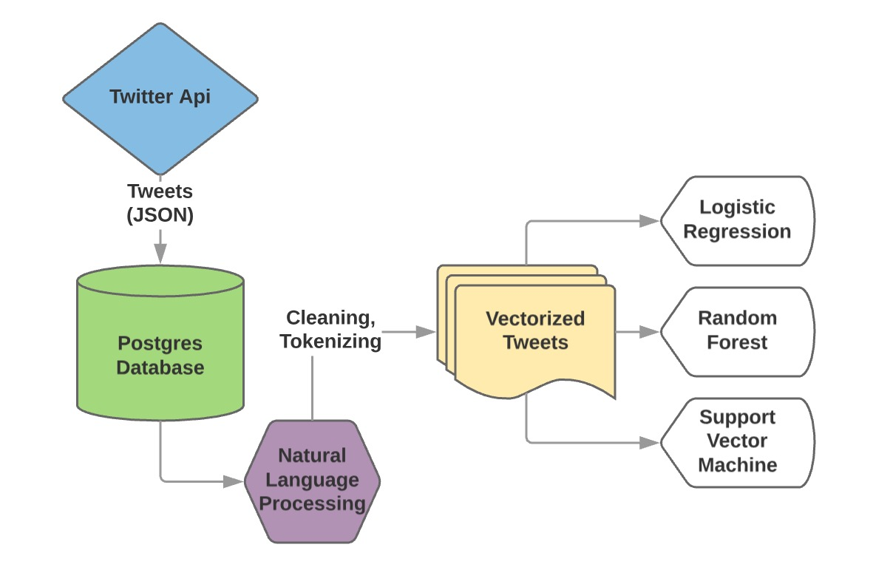

# Identifying Tweet Geographic Location

## Project Motivation

## Process Overview

## Data Sources
### Database
A PostgreSQL database was built, using SQLAlchemy to construct the schema.

### Twitter
Tweepy was used to access the Twitter API. Live-streamed tweets, restricted to those that were geotagged and located within the continental U.S., Hawaii, or Alaska, were stored in a PostgreSQL database. Over 3 days, approximately 50,000 tweets were stored for subsequent analysis.

## Defining Geographic Location
Due to the limited number of tweets, geographic location was defined broadly as:

1. Northeast
2. South
3. Midwest
4. West

A given tweet was mapped to the nearest major city based on its associated longitude and latitude. Regional location was defined based on the tweet's assigned city.

## Defining Sentiment

### VADER

### Textblob

## Visualizations
All visualizations were presented on Jupyter notebook.

## Class Imbalance

### SMOTE

### Random Oversampling

## Regional Variations

## Natural Language Processing: Feature Extraction
In order to be used in machine learning algorithms, text must be converted into vectors of numbers. Such vectors are intended to represent characteristics of the texts.

**n-gram features:** The size of word pairings were also assessed: unigram (only single words are counted), bigram (1 to 2 words are counted), trigram (1 to 3 words are counted). That is, you can also work with pairs and triplets of words, rather than just single words. For example, 'new york' is more informative than 'new' and 'york', separately.

### Bag-of-Words (BoW)
A BoW is a simplistic representation of a document; the occurrence of each word is measured and used as a feature. It is called a *bag* of words because the arrangement of the words, or any other details, are not considered. Documents are simply characterized by the presence of known words.

**Count Vectorization**

The (count) frequency of each known word in a given document is measured.

**TF-IDF Vectorization**

The frequency of each known word is offset by its overall frequency in the corpus (the collection of documents).

### NLP Model Selection

## Machine Learning: Tweet Identification
The following machine learning classification algorithms were used:
* Multinomial Naive Bayes
* Logistic Regression
* Random Forest
* Gradboost
* Adaboost
* Support Vector Machine

For cross-validation, the tweet dataset was split into training and validation sets.

For each classifier, a grid-search was run to determine the best hyperparameters for the given classifier. Classifiers were then fit on the training data and assessed using the following metrics:

* Validation accuracy
* Confusion matrices

### Cross-Validation: Validation Accuracy
A given classification model was fit on the training data. It then classified the validation data. To assess the accuracy of the model, those predictions were compared to the actual labels.

### Confusion Matrices
For a given classifier, a confusion matrix could be constructed. The confusion matrix is used to show the number of:

### Machine Learning Model Selection

## Conclusions
